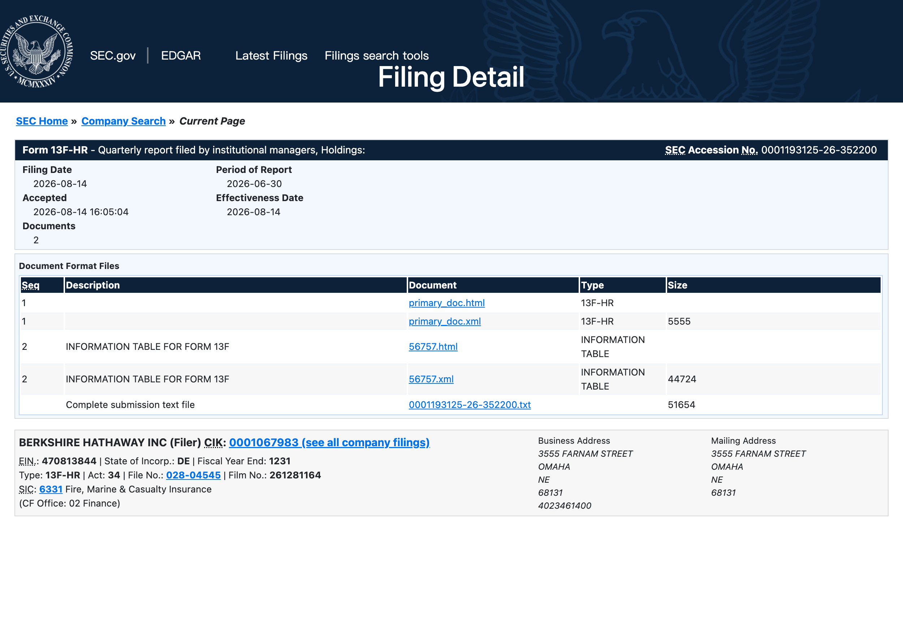
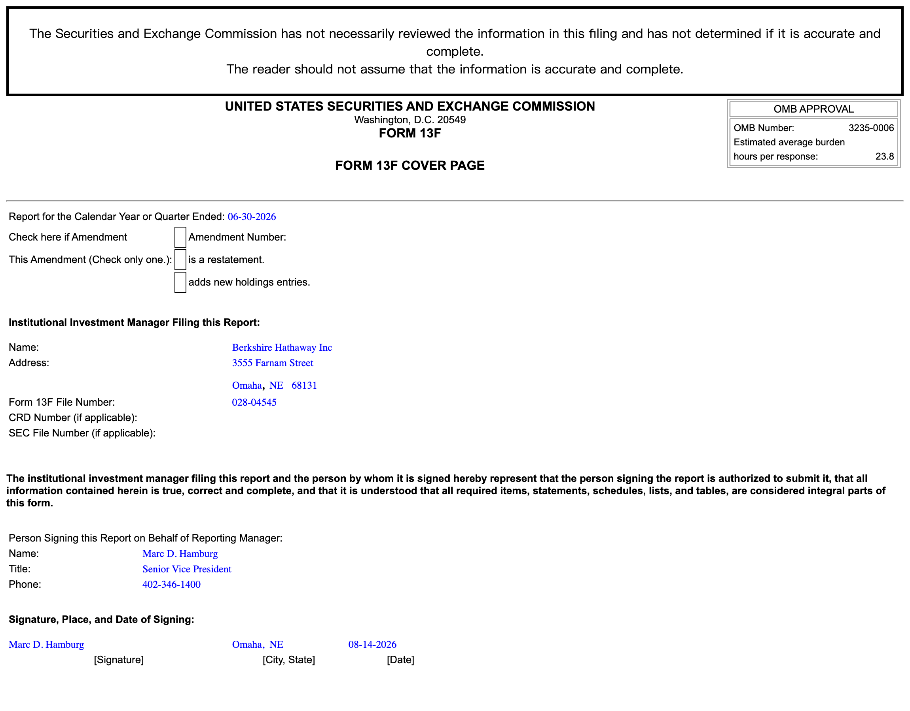
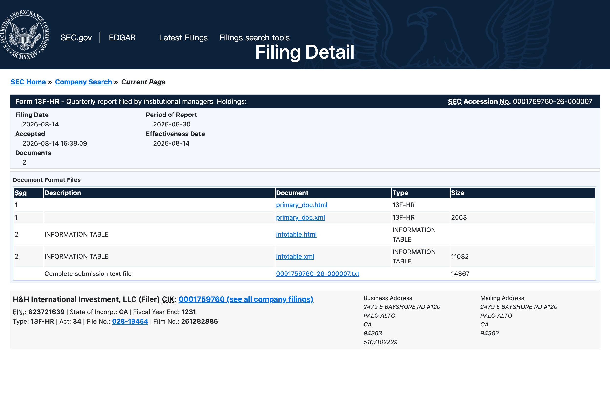
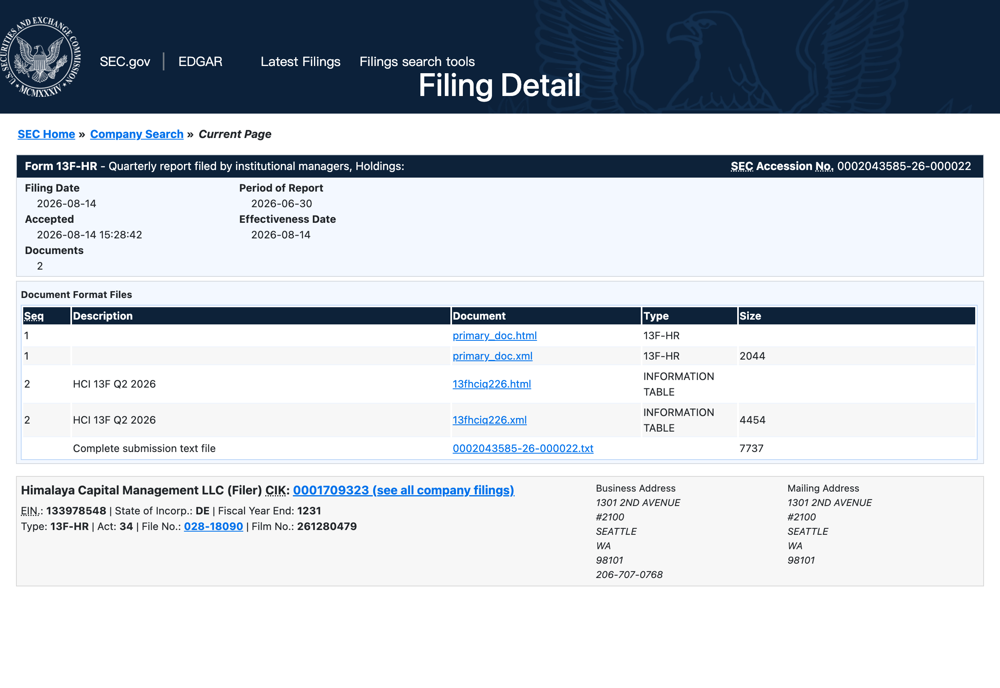
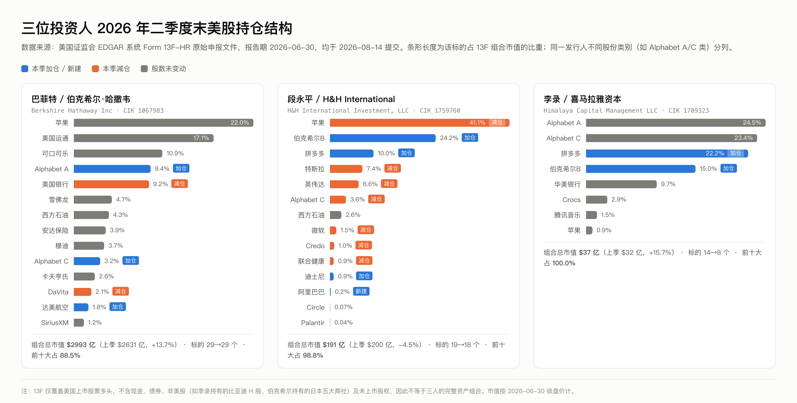
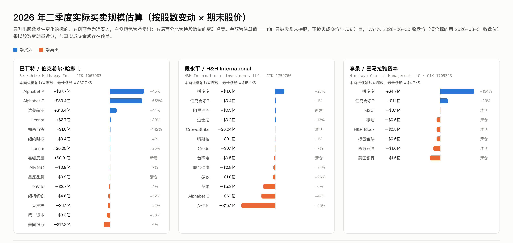
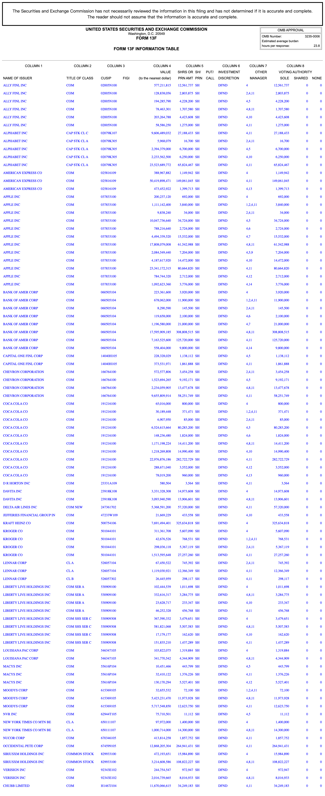
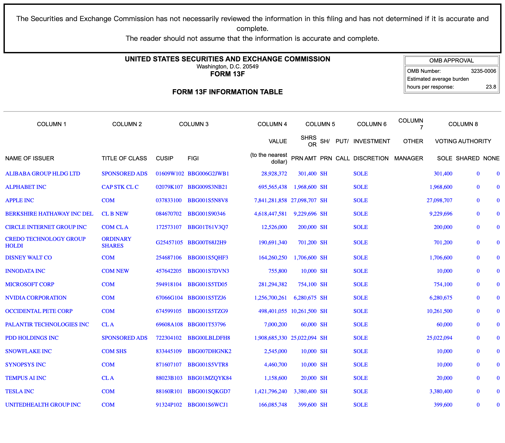
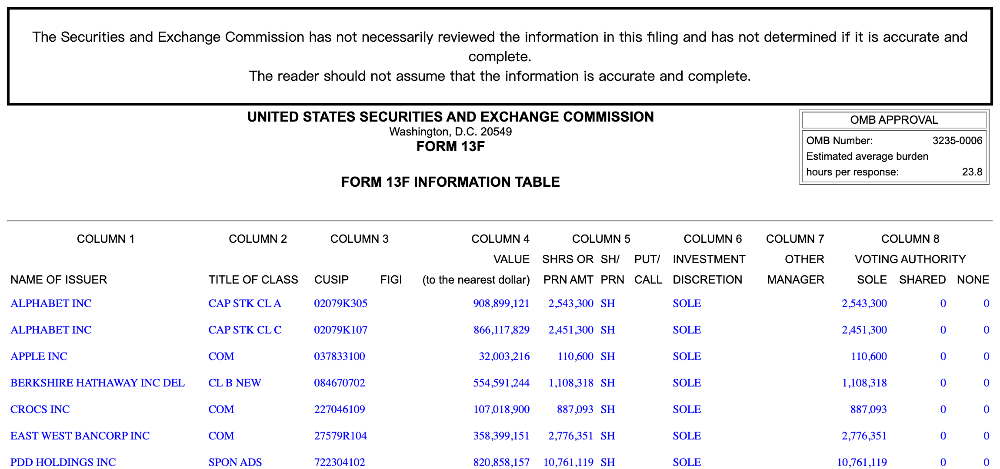
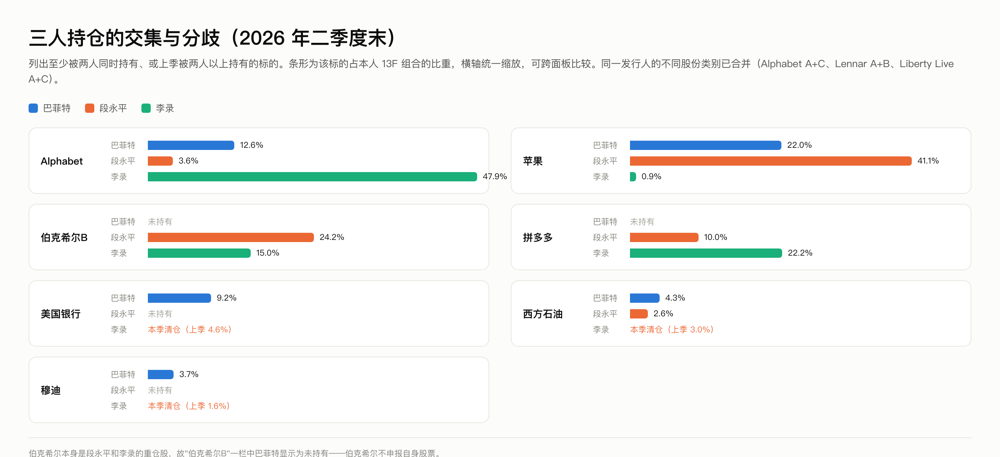

# 巴菲特、段永平、李录 2026Q2 13F 持仓全解

> 报告期：2026-06-30 ｜ 三份文件均于 2026-08-14 提交 SEC ｜ 研究日期：2026-08-15
> 数据来源：美国证监会 EDGAR 系统 Form 13F-HR 原始申报文件（XML），全部数字由原始文件逐条解析计算，未经第三方平台中转

---

## 摘要

| 维度 | 巴菲特 / 伯克希尔 | 段永平 / H&H | 李录 / 喜马拉雅 |
|---|---:|---:|---:|
| 13F 组合市值 | $2,992.5 亿 | $191.0 亿 | $37.0 亿 |
| 环比 | +13.74% | −4.52% | +15.67% |
| 标的数（按 CUSIP） | 29 → 29 | 19 → 18 | 14 → 8 |
| 前十大集中度 | 88.5% | 98.8% | 100% |
| 第一大持仓 | 苹果 22.04% | 苹果 41.05% | Alphabet 47.94%（A+C） |
| 本季主线 | 大举加仓 Alphabet，净买入创近年新高 | 砍英伟达、加拼多多、新建阿里 | 大幅收缩，一季度前刚建的仓位几乎全清 |

**口径说明：**上表"标的数"和"前十大集中度"按 CUSIP 计（Alphabet A 类与 C 类算两个）。若按发行人合并同一公司的不同股份类别，伯克希尔的前十大集中度为 91.0%、标的数 26 个，李录的第一大持仓是 Alphabet 47.94%。两种口径在不同平台上都有人用，比较时要对齐。

### 五条核心发现

**一、巴菲特在二季度停止了囤积现金，转为大规模买入。** 现金流量表口径下，伯克希尔二季度买入股票 $234.7 亿、卖出 $36.9 亿，净买入 $197.7 亿；同期回购自家股票 $42.1 亿。现金加短期美国国债从一季度末的 $3,907.4 亿降至 $3,600.0 亿，单季减少 $307.4 亿。（来源：2026Q2 10-Q，非 13F）

**二、Alphabet 已成为伯克希尔第三大持仓。** A 类加 C 类合计 1.0598 亿股、市值 $377.6 亿，占 13F 组合 12.62%，超过可口可乐（10.86%）。本季 A 类加仓 45.2%、C 类加仓 658.3%，按期末价估算净投入约 $171 亿——这一笔就占了全季净买入的绝大部分。

**三、段永平在减仓英伟达，同时加仓拼多多、新建阿里巴巴。** 英伟达持股从 1,384 万股砍到 628 万股（−54.6%，按期末价约 $15.1 亿），Alphabet C 类减 46.9%，微软减 25.8%，台积电和 CrowdStrike 清仓。另一边拼多多加仓 26.7%，新建阿里巴巴 30.14 万股（$2,893 万，占比仅 0.15%）。苹果小幅减 6.4%，但因股价上涨，权重反而从 36.72% 升到 41.05%。

**四、李录做了一次罕见的大收缩，并且推翻了自己上一个季度的操作。** 标的从 14 个降到 8 个。2026Q1 他罕见地新开了 5 个仓位（腾讯音乐、标普全球、穆迪、H&R Block、MSCI），二季度就把其中 4 个全部清仓，持有期只有一个季度；同时清掉美国银行和西方石油。唯一的大动作是拼多多——从 460.8 万股加到 1,076.1 万股（+133.5%），一举成为第三大持仓（22.17%）。

**五、三人的唯一共同点是 Alphabet 和苹果，但方向完全相反。** 巴菲特大举加仓 Alphabet，李录满仓不动（占其组合 47.94%），段永平却在减持 46.9%。苹果这边，段永平重仓 41.05% 并小幅减持，巴菲特 22.04% 一股未动，李录只有 0.86%。

---

## 一份必须先说的数据陷阱

三份文件里都出现了同一发行人在两个季度用不同登记名称申报的情况：

| 机构 | Q1 申报名 | Q2 申报名 | CUSIP | 真实变动 |
|---|---|---|---|---|
| 伯克希尔 | BANK AMERICA CORP | BANK OF AMER CORP | 060505104 | 减仓 5.9%（不是清仓再买） |
| 伯克希尔 | CHUBB LTD SWITZ | CHUBB LIMITED | H1467J104 | 股数一股未变 |
| 喜马拉雅 | TENCENT MUSIC ENTMT GROUP | TENCENT MUSIC ENTERTAINM | 88034P109 | 股数一股未变 |

如果按"发行人名称"做两期比对，这三笔会被机械地判成"清仓 + 新建仓"，伯克希尔会凭空多出一笔 $250 亿的清仓和一笔 $275 亿的建仓。本报告全部按 CUSIP 归并计算。看到第三方平台出现"巴菲特清仓美国银行"这类标题时，这是一个需要先排除的解释。

同理，同一发行人的不同股份类别（Alphabet A/C、Lennar A/B、Liberty Live A/C）在 13F 里是分开的行，加总时要注意口径。

---

## 原始文件与核验方法

三份文件的 SEC 备案号、提交时间、直达链接：

| 机构 | CIK | Accession No. | 提交时间 | 申报总市值 | 条目数 | 保密处理 |
|---|---|---|---|---:|---:|---|
| Berkshire Hathaway Inc | 1067983 | [0001193125-26-352200](https://www.sec.gov/Archives/edgar/data/1067983/000119312526352200/0001193125-26-352200-index.htm) | 2026-08-14 16:05:04 | $299,253,556,246 | 89 | 无 |
| H&H International Investment, LLC | 1759760 | [0001759760-26-000007](https://www.sec.gov/Archives/edgar/data/1759760/000175976026000007/0001759760-26-000007-index.htm) | 2026-08-14 | $19,100,584,155 | 18 | 无 |
| Himalaya Capital Management LLC | 1709323 | [0002043585-26-000022](https://www.sec.gov/Archives/edgar/data/1709323/000204358526000022/0002043585-26-000022-index.htm) | 2026-08-14 | $3,702,921,099 | 8 | 无 |

三份文件封面的 `isConfidentialOmitted` 字段均为 `false`，即本季没有任何一家申请保密处理（confidential treatment）来隐藏持仓。三份文件的 `putCall` 字段全部为空，即申报范围内没有期权头寸。

**核验方法：**直接从 EDGAR 拉取八份原始 XML（三家的 2026Q1 与 2026Q2，加上段永平、李录的 2025Q4），用脚本逐条解析 infoTable，按 CUSIP 归并同一发行人的多行申报（伯克希尔 89 行来自 14 家保险子公司分别申报，归并后为 29 个 CUSIP、26 个发行人），再做逐期比对。每家每期的解析合计值与封面 `tableValueTotal` 字段完全一致，可确认解析无遗漏。伯克希尔的现金、国债与买卖股票现金流来自 10-Q 的 XBRL 数据与财务报表原页。

*图 1：伯克希尔 2026Q2 13F-HR 在 SEC EDGAR 的备案详情页（原图）*

*图 2：伯克希尔 13F 封面页（SEC 官方渲染），报告期 2026-06-30，条目 89 条，合计 $299,253,556,246，`isConfidentialOmitted = false`*

*图 3：段永平 H&H International Investment 的备案详情页（原图），CIK 0001759760，13F 文件编号 028-19454*

*图 4：李录 Himalaya Capital Management 的备案详情页（原图），CIK 0001709323，13F 文件编号 028-18090，2026-08-14 15:28:42 被 EDGAR 接收*

---

## 全局图：三人持仓结构

*图 5：三位投资人 2026Q2 末美股持仓结构。条形长度为占本人 13F 组合的比重*

*图 6：二季度买卖规模估算。注意三个面板横轴各自独立缩放*

---

## 一、巴菲特 / 伯克希尔·哈撒韦

### 1.1 组合概况

| 指标 | 2026Q1 | 2026Q2 | 变化 |
|---|---:|---:|---:|
| 13F 申报市值 | $2,630.96 亿 | $2,992.54 亿 | +13.74% |
| 申报条目数 | 90 条 | 89 条 | −1 |
| 标的数（按 CUSIP 归并） | 29 | 29 | 0 |
| 前十大集中度 | 90.7% | 88.5% | −2.2pp |

组合市值涨了 13.74%，但这里面大部分不是买出来的。若把一季度末的持仓一股不动拿到二季度末，市值本身就会涨 8.01%。

从换手看，本季有 15 个标的的股数发生变化、15 个完全没动，但没动的那 15 个占了二季度末市值的 **71.9%。**前十大持仓里只有三行动过——Alphabet A 类、Alphabet C 类、美国银行。苹果、可口可乐、美国运通、雪佛龙、西方石油、安达保险、穆迪、卡夫亨氏全部一股未动。

### 1.2 本季全部变动（7 加仓、1 新建、6 减仓、1 清仓）

| 标的 | 动作 | Q1 股数 | Q2 股数 | 变动 | 幅度 | 估算金额 |
|---|:--:|---:|---:|---:|---:|---:|
| Alphabet A 类 | 加仓 | 54,249,798 | 78,791,167 | +24,541,369 | +45.2% | +$87.7 亿 |
| Alphabet C 类 | 加仓 | 3,585,215 | 27,188,433 | +23,603,218 | +658.3% | +$83.4 亿 |
| 达美航空 | 加仓 | 39,809,456 | 57,320,000 | +17,510,544 | +44.0% | +$16.4 亿 |
| Lennar A 类 | 加仓 | 10,099,642 | 13,111,741 | +3,012,099 | +29.8% | +$2.7 亿 |
| 梅西百货 | 加仓 | 3,038,355 | 7,347,426 | +4,309,071 | +141.8% | +$1.0 亿 |
| 纽约时报 | 加仓 | 15,146,535 | 15,700,000 | +553,465 | +3.7% | +$0.4 亿 |
| Lennar B 类 | 加仓 | 237,703 | 298,117 | +60,414 | +25.4% | +$0.05 亿 |
| 霍顿房屋 | 新建 | 0 | 3,564 | +3,564 | — | +$0.01 亿 |
| Ally 金融 | 减仓 | 29,000,000 | 27,000,000 | −2,000,000 | −6.9% | −$0.9 亿 |
| 星座品牌 | 清仓 | 632,890 | 0 | −632,890 | −100% | −$0.9 亿 |
| DaVita | 减仓 | 30,100,585 | 28,880,209 | −1,220,376 | −4.1% | −$2.7 亿 |
| 纽柯钢铁 | 减仓 | 3,907,075 | 1,857,752 | −2,049,323 | −52.5% | −$4.6 亿 |
| 克罗格 | 减仓 | 50,000,000 | 39,000,000 | −11,000,000 | −22.0% | −$6.1 亿 |
| 第一资本 | 减仓 | 7,150,000 | 3,000,000 | −4,150,000 | −58.0% | −$8.3 亿 |
| 美国银行 | 减仓 | 513,624,165 | 483,394,015 | −30,230,150 | −5.9% | −$17.2 亿 |

估算金额 = 股数变动 × 期末股价（清仓标的用 2026-03-31 价），非真实成交额。13F 不披露成交价与成交时点。

### 1.3 Alphabet：一笔占全季度大头的买入

这是本季最大的动作。A 类加 2,454 万股、C 类加 2,360 万股，合计增持 4,814 万股，按期末价约 $171 亿。

| | Q1 | Q2 |
|---|---:|---:|
| A 类（GOOGL，02079K305） | 54,249,798 股 / $156.00 亿 | 78,791,167 股 / $281.58 亿 |
| C 类（GOOG，02079K107） | 3,585,215 股 / $10.28 亿 | 27,188,433 股 / $96.06 亿 |
| 合计 | 57,835,013 股 / $166.29 亿 | 105,979,600 股 / $377.64 亿 |
| 占 13F 组合 | 6.32% | 12.62% |

Alphabet 因此从伯克希尔的第五大持仓升至**第三大，**超过可口可乐（$325.08 亿 / 10.86%）。前四大变为：苹果 22.04%、美国运通 17.14%、Alphabet 12.62%、可口可乐 10.86%。

值得注意的是 C 类的加仓幅度（+658.3%）远大于 A 类（+45.2%）。A 类有投票权、C 类没有。伯克希尔在两个类别上同时大额买入、且明显提高了无投票权 C 类的占比，这与"不谋求影响公司治理、纯粹要经济利益"的一贯做法一致（事实陈述；具体动机文件中未披露）。

### 1.4 这笔加仓有一半是场外拿的——Alphabet 定向配售

13F 只显示股数变了，不显示股从哪来。这一笔的答案在 Alphabet 自己的 SEC 文件里。

2026 年 6 月 1 日，Alphabet 提交自由书面招股说明书（FWP，CIK 1652044，注册号 333-296395），宣布总额 $800 亿的股权融资计划，用于扩建 AI 算力基础设施。文件原文：

> "Alphabet has reached an agreement to sell $10 billion of stock to Berkshire Hathaway Inc. in a private placement, comprised of $5 billion in Class A Common Stock at a price of $351.81 per share and $5 billion in Class C Capital Stock at a price of $348.20 per share."
> —— [Alphabet Inc. FWP, 2026-06-01](https://www.sec.gov/Archives/edgar/data/1652044/000119312526251733/d160205dfwp.htm)

按公告价格折算，这笔定向配售对应：

| | 配售金额 | 配售价 | 对应股数 | 本季实际增持 | 差额（配售之外） |
|---|---:|---:|---:|---:|---:|
| A 类 | $50 亿 | $351.81 | 14,212,217 | 24,541,369 | +10,329,152 |
| C 类 | $50 亿 | $348.20 | 14,359,563 | 23,603,218 | +9,243,655 |
| 合计 | $100 亿 | — | 28,571,780 | 48,144,587 | **+19,572,807** |

也就是说：本季 4,814 万股的增持里，约 2,857 万股（59%）来自这笔场外定向配售，剩下约 1,957 万股（41%，按期末价约 $69.6 亿）来自其他渠道——公开市场买入，或参与同期 $150 亿的公开增发。13F 不区分来源，这个拆分是把两份文件对起来推出来的。

配售价 $351.81（A 类）低于伯克希尔二季度末的持仓均价 $357.37（由申报市值除以申报股数反算），即配售价比季末市价低约 1.6%。

这件事改变了对这笔投资的解读：**这不是一次单纯的二级市场建仓，而是伯克希尔直接向 Alphabet 提供了 $100 亿的一级市场资金，用于对方的 AI 资本开支。** 伯克希尔历史上的类似交易（2008 年高盛、2011 年美国银行、2019 年西方石油）都带有优先股或认股权证等特殊条款；这一次公开文件显示是普通股平价配售，未见优先条款——就披露信息看，条件比历史上那几笔要"素"得多。

（说明：定向配售协议签署于 6 月 1 日，本报告按其在二季度内完成交割推算。若实际交割跨季，上表的拆分比例会变化。）

### 1.5 现金流量表交叉验证：这不只是加仓，是转向

13F 只告诉你季末持有什么，10-Q 才告诉你钱怎么动的。把两份文件对起来看，本季的信号比 13F 单独看要强得多。

| 项目（百万美元） | 2026Q1 | 2026Q2 | 数据来源 |
|---|---:|---:|---|
| 买入股票 | 15,938 | **23,467** | 10-Q 现金流量表，二季度数 = 上半年数 − 一季度数 |
| 卖出股票 | 24,087 | 3,693 | 同上 |
| 净买入 | −8,149（净卖出） | **+19,774** | 计算值 |
| 回购自家股票 | 235 | **4,209** | 10-Q 现金流量表 |
| 现金及等价物（保险及其他） | 51,478 | 35,096 | 10-Q 资产负债表 |
| 短期美国国债 | 339,261 | 324,905 | 10-Q 资产负债表 |
| 现金 + 短期国债 | **390,739** | **360,001** | 计算值，环比 −30,738 |

一季度还在净卖出 $81 亿，二季度掉头净买入 $198 亿；回购从 $2.35 亿跳到 $42.1 亿；现金加国债单季少了 $307 亿。三个指标同时转向。

**一个必须提示的口径细节：**资产负债表上还有一项"应付购买美国国债款"（Payable for purchases of U.S. Treasury Bills），一季度末为 $172.00 亿、二季度末为 $7.71 亿。这是国债交割在途的负债。若从现金加国债中扣掉这一项，一季度末为 $3,735.4 亿、二季度末为 $3,592.3 亿，环比减少 $143.1 亿，而不是 $307.4 亿。两个口径都成立，差别在于是否把在途交割算进去——引用这个数字时要说明用的是哪个口径。

另外，13F 申报的股票市值（$2,992.5 亿）与资产负债表上的"权益证券投资"（$3,237.79 亿）差 $245.3 亿。这部分是不属于 13F 申报范围的持仓，主要是日本五大商社等非美股。一季度末这个差额是 $249.4 亿，两期基本持平。

### 1.6 反面：不要过度解读

- 没动的持仓占二季度末市值的 71.9%，包括苹果、可口可乐、美国运通、西方石油、雪佛龙、安达保险等全部核心仓。撇开 Alphabet 这一笔，这仍然是一个极度稳定的组合。
- 一季度伯克希尔是净卖出 $81 亿，二季度净买入 $198 亿。**单个季度不构成趋势。** 上半年合计净买入 $116 亿，放在 $3,600 亿现金加国债的体量下，只动用了约 3%。
- 现金加国债从 $3,907.4 亿降到 $3,600.0 亿，仍在历史高位区间。作为参照，2025 年底是 $3,691.5 亿（现金 $477.19 亿 + 国债 $3,214.34 亿），二季度末只比半年前低了 $91.5 亿。说"巴菲特开始大规模花钱了"，数据目前只支持"这个季度花得比往常多"。
- 13F 不区分是巴菲特本人还是 Todd Combs / Ted Weschler 决定的。梅西百货、纽约时报、霍顿房屋这类小仓位（合计不到组合的 0.5%）通常被认为出自副手，但文件本身不披露决策人。

*图 7：伯克希尔 2026Q2 Form 13F 信息表全文（SEC 官方渲染，89 条完整申报）。同一标的出现多行，是因为 14 家子公司分别申报*

---

## 二、段永平 / H&H International Investment

### 2.1 组合概况

| 指标 | 2025Q4 | 2026Q1 | 2026Q2 |
|---|---:|---:|---:|
| 13F 申报市值 | $174.89 亿 | $200.04 亿 | $191.01 亿 |
| 环比 | — | +14.38% | −4.52% |
| 标的数 | 14 | 19 | 18 |
| 前十大集中度 | — | 99.2% | 98.8% |
| 苹果权重 | 50.30% | 36.72% | 41.05% |

申报人为首席合规官 Eric Hu，无其他包含管理人，无保密处理申请。

组合缩水 4.52% 不是因为持仓跌了——如果一季度末的持仓一股不动拿到二季度末，市值会涨 7.65%。缩水是卖出来的：本季估算卖出约 $29.2 亿、买入约 $4.9 亿，净卖出 $24.3 亿。

### 2.2 本季全部变动

| 标的 | 动作 | Q1 股数 | Q2 股数 | 变动 | 幅度 | 估算金额 |
|---|:--:|---:|---:|---:|---:|---:|
| 英伟达 | 减仓 | 13,843,775 | 6,280,675 | −7,563,100 | −54.6% | −$15.1 亿 |
| Alphabet C 类 | 减仓 | 3,706,000 | 1,968,600 | −1,737,400 | −46.9% | −$6.1 亿 |
| 苹果 | 减仓 | 28,945,607 | 27,098,707 | −1,846,900 | −6.4% | −$5.3 亿 |
| 微软 | 减仓 | 1,016,000 | 754,100 | −261,900 | −25.8% | −$1.0 亿 |
| 联合健康 | 减仓 | 601,400 | 399,600 | −201,800 | −33.6% | −$0.8 亿 |
| 台积电 | 清仓 | 151,200 | 0 | −151,200 | −100% | −$0.5 亿 |
| Credo | 减仓 | 751,200 | 701,200 | −50,000 | −6.7% | −$0.1 亿 |
| 特斯拉 | 减仓 | 3,408,900 | 3,380,400 | −28,500 | −0.8% | −$0.1 亿 |
| CrowdStrike | 清仓 | 10,000 | 0 | −10,000 | −100% | −$0.04 亿 |
| 拼多多 | 加仓 | 19,748,294 | 25,022,094 | +5,273,800 | +26.7% | +$4.0 亿 |
| 伯克希尔 B | 加仓 | 9,147,796 | 9,229,696 | +81,900 | +0.9% | +$0.4 亿 |
| 阿里巴巴 | 新建 | 0 | 301,400 | +301,400 | — | +$0.3 亿 |
| 迪士尼 | 加仓 | 1,511,800 | 1,706,600 | +194,800 | +12.9% | +$0.2 亿 |

未变动：西方石油 10,261,500 股、Circle 20 万股、Palantir 6 万股、新思科技 1 万股、Snowflake 1 万股、Tempus AI 2 万股、Innodata 1 万股。

### 2.3 英伟达：一个完整的往返

把三个季度连起来看，这笔操作的形状才出来：

| | 2025Q4 | 2026Q1 | 2026Q2 |
|---|---:|---:|---:|
| 持股 | 7,237,100 | 13,843,775 | 6,280,675 |
| 环比 | — | **+91.3%** | **−54.6%** |
| 市值 | $13.50 亿 | $24.14 亿 | $12.57 亿 |
| 占组合 | 7.72% | 12.07% | 6.58% |
| 期末股价（申报值反算） | $186.50 | $174.40 | $200.09 |

一季度接近翻倍加仓，二季度砍掉一半以上，持股数已低于 2025 年底。两个季度净减 13.2%。买入发生在股价 $186 到 $174 的区间，卖出发生在股价回到 $200 之后——单从价格看这笔往返不亏，但持仓路径本身说明这不是一个长期头寸。

需要说明的是：**没有找到段永平本人对本季操作的公开说明。** 截至 2026-08-15，检索未发现他在雪球或推特上对二季度减持英伟达、加仓拼多多、重新买入阿里巴巴作出解释。媒体上流传的动机推断（"能力圈"、"看不懂 AI"等）多是引用他 2025 年的旧发言，不能作为本季操作的依据。这一栏留白，比填一个推测更诚实。

### 2.4 阿里巴巴：清仓一个季度后又买回来

| | 2025Q4 | 2026Q1 | 2026Q2 |
|---|---:|---:|---:|
| 持股 | 2,560,500 | 0（清仓） | 301,400（新建） |
| 市值 | $3.75 亿 | $0 | $0.29 亿 |
| 占组合 | 2.15% | 0% | 0.15% |

买回来的量只有原来的 11.8%，占组合 0.15%，是一个试探性头寸的规模，不是回归重仓。

### 2.5 中国资产在加，美国 AI 在减

本季操作有一个方向性很清楚的分布：

- **减的：**英伟达（−54.6%）、Alphabet C（−46.9%）、微软（−25.8%）、联合健康（−33.6%）、台积电（清仓）、CrowdStrike（清仓）——集中在美国大科技与 AI 相关。
- **加的：**拼多多（+26.7%）、阿里巴巴（新建）——集中在中概。

拼多多是连续第二个季度加仓：11,536,694（2025Q4）→ 19,748,294（2026Q1）→ 25,022,094（2026Q2），两个季度累计 +117%。而拼多多股价在二季度从 $102.18 跌到 $76.28（−25.3%），这一季的加仓是在下跌中完成的。

**反面：**这个"减美股 AI、加中概"的概括有两个漏洞。第一，苹果仍占组合 41.05%，是绝对第一大重仓，本季只减了 6.4%；伯克希尔 B 占 24.18% 还在加。前两大持仓合计 65.2%，都是美国资产，结构上并没有转向。第二，被减的英伟达、Alphabet、微软本季股价都在涨（英伟达 +14.7%、Alphabet C +23.2%、微软 +0.8%），减仓也可能只是涨上来后的再平衡，不一定是看法变化。文件本身不区分这两者。

*图 8：H&H International Investment 2026Q2 Form 13F 信息表全文（SEC 官方渲染，18 条完整申报）*

---

## 三、李录 / 喜马拉雅资本

### 3.1 组合概况

| 指标 | 2025Q4 | 2026Q1 | 2026Q2 |
|---|---:|---:|---:|
| 13F 申报市值 | $35.69 亿 | $32.01 亿 | $37.03 亿 |
| 环比 | — | −10.31% | +15.67% |
| 标的数 | 9 | 14 | **8** |
| 前十大集中度 | 100% | 95.6% | **100%** |

三个季度走了一个"扩张再收回"的完整来回：9 → 14 → 8。二季度末的标的数比一年前还少。

### 3.2 本季全部变动

| 标的 | 动作 | Q1 股数 | Q2 股数 | 变动 | 幅度 | 估算金额 |
|---|:--:|---:|---:|---:|---:|---:|
| 拼多多 | 加仓 | 4,608,000 | 10,761,119 | +6,153,119 | +133.5% | +$4.7 亿 |
| 伯克希尔 B | 加仓 | 897,749 | 1,108,318 | +210,569 | +23.5% | +$1.1 亿 |
| 美国银行 | 清仓 | 2,997,987 | 0 | −2,997,987 | −100% | −$1.5 亿 |
| 西方石油 | 清仓 | 1,466,500 | 0 | −1,466,500 | −100% | −$1.0 亿 |
| 标普全球 | 清仓 | 121,463 | 0 | −121,463 | −100% | −$0.5 亿 |
| H&R Block | 清仓 | 1,626,906 | 0 | −1,626,906 | −100% | −$0.5 亿 |
| 穆迪 | 清仓 | 117,784 | 0 | −117,784 | −100% | −$0.5 亿 |
| MSCI | 清仓 | 18,939 | 0 | −18,939 | −100% | −$0.1 亿 |

未变动：Alphabet A 254.33 万股、Alphabet C 245.13 万股、华美银行 277.64 万股、Crocs 88.71 万股、腾讯音乐 659.08 万股、苹果 11.06 万股。

只有两个方向：加拼多多和伯克希尔，其余全是清仓。没有一笔"减一点"，全是"清光"。

### 3.3 他推翻了自己上一个季度的操作

这是本季最值得注意的一点。把 2026Q1 和 Q2 并排放：

| 标的 | 2025Q4 | 2026Q1 | 2026Q2 | 结果 |
|---|---:|---:|---:|---|
| 腾讯音乐 | 0 | 6,590,836（新建） | 6,590,836 | 留下 |
| 标普全球 | 0 | 121,463（新建） | 0 | **一个季度后清仓** |
| 穆迪 | 0 | 117,784（新建） | 0 | **一个季度后清仓** |
| H&R Block | 0 | 1,626,906（新建） | 0 | **一个季度后清仓** |
| MSCI | 0 | 18,939（新建） | 0 | **一个季度后清仓** |
| 美国银行 | 10,431,387 | 2,997,987（−71.3%） | 0 | 两个季度清完 |
| 西方石油 | 1,466,500 | 1,466,500 | 0 | 清仓 |

一季度新开的 5 个仓位，二季度清掉 4 个，持有期只有一个季度。这四家（标普全球、穆迪、MSCI、H&R Block）在一季度被广泛解读为"金融数据/评级基础设施"的主题配置——如果确实是一个主题下注，那么这个主题在一个季度内就被完全放弃了。

对一位以长期持有著称、组合常年不足 10 只股票的投资人来说，这个换手率是异常的。**但要注意两个可能的替代解释：**其一，这四笔仓位单笔都在 $1,000 万到 $5,200 万之间，占组合 0.3%–1.6%，规模上更接近试探性头寸而非核心配置；其二，13F 不披露原因，也无法排除申报口径调整、账户结构变化等非投资性因素。文件本身不支持进一步判断。

### 3.4 拼多多成为第三大持仓

| | 2025Q4 | 2026Q1 | 2026Q2 |
|---|---:|---:|---:|
| 持股 | 4,608,000 | 4,608,000 | 10,761,119 |
| 市值 | $5.23 亿 | $4.71 亿 | $8.21 亿 |
| 占组合 | 14.64% | 14.71% | **22.17%** |
| 期末股价 | $113.39 | $102.18 | $76.28 |

连续两个季度按兵不动后，在股价从 $102 跌到 $76（−25.3%）的这个季度里一次性加了 133.5%。加仓成本区间无法从 13F 得知，但整个二季度拼多多的价格都在下行通道中。

值得并列观察的是：段永平同期也在加拼多多（+26.7%）。两人在同一个季度、同一只票上同向加仓，是本季三人操作中唯一的明确共识。

### 3.5 一处申报口径的小问题

喜马拉雅的 Alphabet 持仓在三个季度里总股数完全不变（4,994,600 股），但 A/C 两类的股数在 2025Q4 和 2026Q1 之间对调了：

| 季度 | CL A（02079K305） | CL C（02079K107） |
|---|---:|---:|
| 2025Q4 | 2,451,300 | 2,543,300 |
| 2026Q1 | 2,543,300 | 2,451,300 |
| 2026Q2 | 2,543,300 | 2,451,300 |

两类之间恰好互换 92,000 股、总数分毫不差，更像是某一期填报时的类别转置，而非真实的换股操作。两种解释下 Alphabet 的合计仓位都没有变化，不影响任何结论，但引用分类别数据时要留意。

*图 9：Himalaya Capital Management 2026Q2 Form 13F 信息表全文（SEC 官方渲染，8 条完整申报）*

---

## 四、三人对比

### 4.1 谁在动，动了多少

| | 巴菲特 | 段永平 | 李录 |
|---|---:|---:|---:|
| 标的数（Q1→Q2） | 29 → 29 | 19 → 18 | 14 → 8 |
| 股数变动的标的 | 15 | 13 | 8 |
| 完全未动的标的 | 15 | 7 | 6 |
| **未动标的占 Q2 市值** | **71.9%** | **2.8%** | **62.9%** |
| 估算买入 | $191.7 亿 | $4.9 亿 | $5.8 亿 |
| 估算卖出 | $40.8 亿 | $29.2 亿 | $4.1 亿 |
| 估算净额 | **+$150.9 亿** | **−$24.3 亿** | +$1.7 亿 |
| 持仓不动的话本季涨幅 | +8.01% | +7.65% | +10.41%（注） |

注：李录的静态回报测算中，有 12.7% 的一季度末市值对应本季清仓标的、缺二季度末价格，该数值可靠性低于另外两人。

这张表里最刺眼的是"未动标的占市值"这一行。**段永平只有 2.8%**——他组合里几乎每一个有分量的仓位本季都动过（苹果、伯克希尔、拼多多、特斯拉、英伟达、Alphabet、微软、Credo、联合健康、迪士尼全部有变动），没动的只有西方石油和几只百万美元级的小票。同一季度巴菲特有 71.9% 的市值一动不动。两人的操作密度完全不在一个量级。

李录的 62.9% 有误导性：他的"没动"集中在 Alphabet（47.9%）和华美银行（9.7%），而在动的那部分里，一半是整仓清光。

### 4.2 交集与分歧

*图 10：三人共同持有或曾共同持有的标的*

**同时被三人持有的只有两只：Alphabet 和苹果。** 但仓位含义完全不同。

| 标的 | 巴菲特 | 段永平 | 李录 |
|---|---|---|---|
| **Alphabet** | 12.62%（本季大举加仓，A+C 合计增持 4,814 万股） | 3.64%（本季 C 类减持 46.9%） | 47.94%（三个季度一股未动，第一大持仓） |
| **苹果** | 22.04%（一股未动，第一大持仓） | 41.05%（本季减 6.4%，仍是第一大持仓） | 0.86%（一股未动，最小持仓） |
| **伯克希尔 B** | —（不申报自身股票） | 24.18%（本季加 0.9%，第二大持仓） | 14.98%（本季加 23.5%，第四大持仓） |
| **拼多多** | 未持有 | 9.99%（本季加 26.7%） | 22.17%（本季加 133.5%，第三大持仓） |
| **西方石油** | 4.30%（一股未动） | 2.61%（一股未动） | 本季清仓 |
| **穆迪** | 3.73%（一股未动） | 未持有 | 本季清仓 |
| **美国银行** | 9.20%（本季减 5.9%） | 未持有 | 本季清仓 |

三条可以从数据里直接读出来的结论：

**一、Alphabet 上出现了本季最明显的对立。** 同一个季度里，巴菲特把它买成第三大持仓，段永平把 C 类砍掉近一半。李录则是三个人里持仓最重的（47.94%）也是最不动的（连续三个季度 4,994,600 股不变）。三种做法对应三种不同的判断，13F 不告诉你谁对。

**二、拼多多是唯一的明确共识。** 段永平和李录在同一个季度、同一只票上同向加仓，而这个季度拼多多股价跌了 25.3%（$102.18 → $76.28）。两人合计增持 1,142.7 万股 ADS。

**三、金融和能源被李录单方面清出，另外两人没动。** 美国银行、穆迪、西方石油李录全部清仓，同期巴菲特的穆迪和西方石油一股未动、美国银行只减 5.9%，段永平的西方石油一股未动。

### 4.3 三人的"AI 敞口"走向相反

同一个季度，同一个 AI 主题，三个人做了三件不同的事：

- **巴菲特：**把 $100 亿直接投给 Alphabet 的 AI 资本开支（一级市场定向配售），另外还在二级市场买了约 $69.6 亿。这是三人中唯一在 AI 上加大押注的。
- **段永平：**英伟达砍一半、微软减 25.8%、Alphabet C 减 46.9%、台积电清仓、CrowdStrike 清仓。所有直接的 AI 相关标的全部减仓。
- **李录：**Alphabet 一股未动，其余标的没有 AI 敞口。

需要指出的是，这个"相反"的说法有一个口径问题：段永平减掉的英伟达、Alphabet、微软本季股价都在涨，减仓也可以是被动的仓位再平衡；而巴菲特买 Alphabet 的主体部分是一笔谈定的一级市场交易，与二级市场的择时判断不完全等同。把两者放在同一个"看多/看空 AI"的轴上比较，是一种简化。

---

## 五、13F 这份文件不能告诉你什么

在使用上面任何一个数字之前，这些限制必须先摆出来：

1. **只有美股多头。** 13F 只覆盖 SEC 认定的 13(f) 证券（主要是美国交易所上市的股票、ADR、部分期权与可转债）。现金、债券、港股、A 股、非上市股权全部不在内。李录最著名的持仓是比亚迪 H 股，那部分从来不会出现在这份文件里；本报告不对其当前是否仍持有作任何判断。伯克希尔的日本五大商社同理——本季 13F 申报市值 $2,992.5 亿与资产负债表上的股票投资 $3,237.8 亿之间那 $245.3 亿的差额，就是这类持仓。

2. **45 天滞后。** 二季度末的持仓在 8 月 14 日才公开。三家都是在最后一天（截止日）提交的。这 45 天里发生了什么，文件不说。

3. **只有季末快照，没有过程。** 一个标的季初买入、季中卖出、季末归零，在 13F 里完全看不见。本报告所有"估算金额"都是用期末价乘以股数差得到的，与真实成交额必然有偏差——伯克希尔的例子最清楚：13F 口径估算净买入 $150.9 亿，现金流量表口径的实际净买入是 $197.7 亿，差了 $46.8 亿。

4. **不披露决策人。** 伯克希尔的 89 条申报来自 14 家子公司，但文件里的"其他管理人"编号指的是持股的法律主体（国民赔偿、GEICO、通用再保险等保险子公司），不是投资决策人。哪些是巴菲特买的、哪些是 Todd Combs 或 Ted Weschler 买的，13F 不区分。

5. **不披露动机。** 本报告刻意没有为任何一笔操作编造理由。段永平砍英伟达、李录一个季度清掉四个新仓，公开渠道均未找到本人说明。

6. **空头和衍生品基本看不到。** 本季三份文件的 `putCall` 字段全部为空，说明申报范围内没有期权头寸；但 13F 本身也不要求申报空头，所以"没有空头"这个结论是推不出来的。

---

## 六、待跟进

| # | 事项 | 为什么重要 | 何时能验证 |
|---|---|---|---|
| 1 | Alphabet 定向配售的实际交割日与是否有锁定期 | 决定 4,814 万股增持里配售与二级市场的真实拆分比例 | Alphabet 的 10-Q / 8-K，或伯克希尔的 13D/G（若持股触及 5%） |
| 2 | 段永平本人对二季度操作的公开说明 | 目前是空白，所有动机解读都无据 | 雪球 / 推特，随时 |
| 3 | 李录清掉的四只金融数据股是否在三季度回补 | 判断这是主题放弃还是短期调仓 | 2026Q3 13F（预计 2026-11-14 前提交） |
| 4 | 伯克希尔现金加国债是否延续下降 | 一个季度不构成趋势，需要连续两到三季确认 | 2026Q3 10-Q（预计 11 月初） |
| 5 | 拼多多的加仓是否延续 | 段永平已连加两季、李录本季重仓，三季度是关键检验 | 2026Q3 13F |
| 6 | 三家是否提交 13F-HR/A 修正件 | 修正件会改变本报告的数字 | 持续监控 EDGAR |

---

## 附录：全量持仓表（按 CUSIP 归并，含 2026Q1 对照）

以下三张表由 SEC 原始 XML 逐条解析生成，每张表的市值合计与申报文件封面的 `tableValueTotal` 字段完全一致。

### 巴菲特 / 伯克希尔·哈撒韦 —— 2026Q2 全量持仓与变动

| # | 标的 | 股份类别 | CUSIP | Q1 股数 | Q2 股数 | 股数变动 | 变动% | 动作 | Q2 市值(亿美元) | Q2 权重 | Q1 权重 |
|---:|---|---|---|---:|---:|---:|---:|:--:|---:|---:|---:|
| 1 | 苹果 | COM | 037833100 | 227,917,808 | 227,917,808 | 0 | +0.0% | 未动 | 659.50 | 22.04% | 21.99% |
| 2 | 美国运通 | COM | 025816109 | 151,610,700 | 151,610,700 | 0 | +0.0% | 未动 | 512.82 | 17.14% | 17.43% |
| 3 | 可口可乐 | COM | 191216100 | 400,000,000 | 400,000,000 | 0 | +0.0% | 未动 | 325.08 | 10.86% | 11.56% |
| 4 | Alphabet A | CAP STK CL A | 02079K305 | 54,249,798 | 78,791,167 | +24,541,369 | +45.2% | 加仓 | 281.58 | 9.41% | 5.93% |
| 5 | 美国银行 | COM | 060505104 | 513,624,165 | 483,394,015 | -30,230,150 | -5.9% | 减仓 | 275.44 | 9.20% | 9.52% |
| 6 | 雪佛龙 | COM | 166764100 | 84,375,856 | 84,375,856 | 0 | +0.0% | 未动 | 139.86 | 4.67% | 6.64% |
| 7 | 西方石油 | COM | 674599105 | 264,941,431 | 264,941,431 | 0 | +0.0% | 未动 | 128.68 | 4.30% | 6.55% |
| 8 | 安达保险 | COM | H1467J104 | 34,249,183 | 34,249,183 | 0 | +0.0% | 未动 | 116.70 | 3.90% | 4.24% |
| 9 | 穆迪 | COM | 615369105 | 24,669,778 | 24,669,778 | 0 | +0.0% | 未动 | 111.73 | 3.73% | 4.09% |
| 10 | Alphabet C | CAP STK CL C | 02079K107 | 3,585,215 | 27,188,433 | +23,603,218 | +658.3% | 加仓 | 96.06 | 3.21% | 0.39% |
| 11 | 卡夫亨氏 | COM | 500754106 | 325,634,818 | 325,634,818 | 0 | +0.0% | 未动 | 76.91 | 2.57% | 2.78% |
| 12 | DaVita | COM | 23918K108 | 30,100,585 | 28,880,209 | -1,220,376 | -4.1% | 减仓 | 64.25 | 2.15% | 1.76% |
| 13 | 达美航空 | COM NEW | 247361702 | 39,809,456 | 57,320,000 | +17,510,544 | +44.0% | 加仓 | 53.69 | 1.79% | 1.01% |
| 14 | SiriusXM | COMMON STOCK | 829933100 | 124,807,117 | 124,807,117 | 0 | +0.0% | 未动 | 36.87 | 1.23% | 1.09% |
| 15 | 威瑞信 | COM | 92343E102 | 8,989,880 | 8,989,880 | 0 | +0.0% | 未动 | 22.61 | 0.76% | 0.85% |
| 16 | 克罗格 | COM | 501044101 | 50,000,000 | 39,000,000 | -11,000,000 | -22.0% | 减仓 | 21.66 | 0.72% | 1.38% |
| 17 | Ally金融 | COM | 02005N100 | 29,000,000 | 27,000,000 | -2,000,000 | -6.9% | 减仓 | 12.41 | 0.41% | 0.43% |
| 18 | Lennar | CL A | 526057104 | 10,099,642 | 13,111,741 | +3,012,099 | +29.8% | 加仓 | 11.86 | 0.40% | 0.33% |
| 19 | Liberty Live | COM SHS SER C | 530909308 | 10,587,143 | 10,587,143 | 0 | +0.0% | 未动 | 11.18 | 0.37% | 0.38% |
| 20 | 纽约时报 | CL A | 650111107 | 15,146,535 | 15,700,000 | +553,465 | +3.7% | 加仓 | 10.99 | 0.37% | 0.48% |
| 21 | 第一资本 | COM | 14040H105 | 7,150,000 | 3,000,000 | -4,150,000 | -58.0% | 减仓 | 6.02 | 0.20% | 0.50% |
| 22 | Liberty Live | COM SER A | 530909100 | 4,986,588 | 4,986,588 | 0 | +0.0% | 未动 | 5.05 | 0.17% | 0.17% |
| 23 | 路易斯安那太平洋 | COM | 546347105 | 5,664,793 | 5,664,793 | 0 | +0.0% | 未动 | 4.46 | 0.15% | 0.16% |
| 24 | 纽柯钢铁 | COM | 670346105 | 3,907,075 | 1,857,752 | -2,049,323 | -52.5% | 减仓 | 4.14 | 0.14% | 0.25% |
| 25 | 梅西百货 | COM | 55616P104 | 3,038,355 | 7,347,426 | +4,309,071 | +141.8% | 加仓 | 1.73 | 0.06% | 0.02% |
| 26 | NVR | COM | 62944T105 | 11,112 | 11,112 | 0 | +0.0% | 未动 | 0.76 | 0.03% | 0.03% |
| 27 | Lennar | CL B | 526057302 | 237,703 | 298,117 | +60,414 | +25.4% | 加仓 | 0.26 | 0.01% | 0.01% |
| 28 | 杰富瑞 | COM | 47233W109 | 433,558 | 433,558 | 0 | +0.0% | 未动 | 0.22 | 0.01% | 0.01% |
| 29 | 霍顿房屋 | COM | 23331A109 | 0 | 3,564 | +3,564 | — | 新建 | 0.01 | 0.00% | 0.00% |
| 30 | 星座品牌 | CL A | 21036P108 | 632,890 | 0 | -632,890 | -100.0% | 清仓 | 0.00 | 0.00% | 0.04% |
| | **合计** | | | | | | | | **2992.54** | **100%** | |

### 段永平 / H&H International Investment —— 2026Q2 全量持仓与变动

| # | 标的 | 股份类别 | CUSIP | Q1 股数 | Q2 股数 | 股数变动 | 变动% | 动作 | Q2 市值(亿美元) | Q2 权重 | Q1 权重 |
|---:|---|---|---|---:|---:|---:|---:|:--:|---:|---:|---:|
| 1 | 苹果 | COM | 037833100 | 28,945,607 | 27,098,707 | -1,846,900 | -6.4% | 减仓 | 78.41 | 41.05% | 36.72% |
| 2 | 伯克希尔B | CL B NEW | 084670702 | 9,147,796 | 9,229,696 | +81,900 | +0.9% | 加仓 | 46.18 | 24.18% | 21.91% |
| 3 | 拼多多 | SPONSORED ADS | 722304102 | 19,748,294 | 25,022,094 | +5,273,800 | +26.7% | 加仓 | 19.09 | 9.99% | 10.09% |
| 4 | 特斯拉 | COM | 88160R101 | 3,408,900 | 3,380,400 | -28,500 | -0.8% | 减仓 | 14.22 | 7.44% | 6.34% |
| 5 | 英伟达 | COM | 67066G104 | 13,843,775 | 6,280,675 | -7,563,100 | -54.6% | 减仓 | 12.57 | 6.58% | 12.07% |
| 6 | Alphabet C | CAP STK CL C | 02079K107 | 3,706,000 | 1,968,600 | -1,737,400 | -46.9% | 减仓 | 6.96 | 3.64% | 5.31% |
| 7 | 西方石油 | COM | 674599105 | 10,261,500 | 10,261,500 | 0 | +0.0% | 未动 | 4.98 | 2.61% | 3.33% |
| 8 | 微软 | COM | 594918104 | 1,016,000 | 754,100 | -261,900 | -25.8% | 减仓 | 2.81 | 1.47% | 1.88% |
| 9 | Credo | ORDINARY SHARES | G25457105 | 751,200 | 701,200 | -50,000 | -6.7% | 减仓 | 1.91 | 1.00% | 0.35% |
| 10 | 联合健康 | COM | 91324P102 | 601,400 | 399,600 | -201,800 | -33.6% | 减仓 | 1.66 | 0.87% | 0.81% |
| 11 | 迪士尼 | COM | 254687106 | 1,511,800 | 1,706,600 | +194,800 | +12.9% | 加仓 | 1.64 | 0.86% | 0.73% |
| 12 | 阿里巴巴 | SPONSORED ADS | 01609W102 | 0 | 301,400 | +301,400 | — | 新建 | 0.29 | 0.15% | 0.00% |
| 13 | Circle | COM CL A | 172573107 | 200,000 | 200,000 | 0 | +0.0% | 未动 | 0.13 | 0.07% | 0.10% |
| 14 | Palantir | CL A | 69608A108 | 60,000 | 60,000 | 0 | +0.0% | 未动 | 0.07 | 0.04% | 0.04% |
| 15 | 新思科技 | COM | 871607107 | 10,000 | 10,000 | 0 | +0.0% | 未动 | 0.04 | 0.02% | 0.02% |
| 16 | Snowflake | COM SHS | 833445109 | 10,000 | 10,000 | 0 | +0.0% | 未动 | 0.03 | 0.01% | 0.01% |
| 17 | Tempus AI | CL A | 88023B103 | 20,000 | 20,000 | 0 | +0.0% | 未动 | 0.01 | 0.01% | 0.00% |
| 18 | Innodata | COM NEW | 457642205 | 10,000 | 10,000 | 0 | +0.0% | 未动 | 0.01 | 0.00% | 0.00% |
| 19 | 台积电 | SPONSORED ADS | 874039100 | 151,200 | 0 | -151,200 | -100.0% | 清仓 | 0.00 | 0.00% | 0.26% |
| 20 | CrowdStrike | CL A | 22788C105 | 10,000 | 0 | -10,000 | -100.0% | 清仓 | 0.00 | 0.00% | 0.02% |
| | **合计** | | | | | | | | **191.01** | **100%** | |

### 李录 / 喜马拉雅资本 —— 2026Q2 全量持仓与变动

| # | 标的 | 股份类别 | CUSIP | Q1 股数 | Q2 股数 | 股数变动 | 变动% | 动作 | Q2 市值(亿美元) | Q2 权重 | Q1 权重 |
|---:|---|---|---|---:|---:|---:|---:|:--:|---:|---:|---:|
| 1 | Alphabet A | CAP STK CL A | 02079K305 | 2,543,300 | 2,543,300 | 0 | +0.0% | 未动 | 9.09 | 24.55% | 22.85% |
| 2 | Alphabet C | CAP STK CL C | 02079K107 | 2,451,300 | 2,451,300 | 0 | +0.0% | 未动 | 8.66 | 23.39% | 21.97% |
| 3 | 拼多多 | SPON ADS/SPONSORED ADS | 722304102 | 4,608,000 | 10,761,119 | +6,153,119 | +133.5% | 加仓 | 8.21 | 22.17% | 14.71% |
| 4 | 伯克希尔B | CL B NEW | 084670702 | 897,749 | 1,108,318 | +210,569 | +23.5% | 加仓 | 5.55 | 14.98% | 13.44% |
| 5 | 华美银行 | COM | 27579R104 | 2,776,351 | 2,776,351 | 0 | +0.0% | 未动 | 3.58 | 9.68% | 9.26% |
| 6 | Crocs | COM | 227046109 | 887,093 | 887,093 | 0 | +0.0% | 未动 | 1.07 | 2.89% | 2.30% |
| 7 | 腾讯音乐 | SPON ADS | 88034P109 | 6,590,836 | 6,590,836 | 0 | +0.0% | 未动 | 0.55 | 1.49% | 1.91% |
| 8 | 苹果 | COM | 037833100 | 110,600 | 110,600 | 0 | +0.0% | 未动 | 0.32 | 0.86% | 0.88% |
| 9 | 美国银行 | COM | 060505104 | 2,997,987 | 0 | -2,997,987 | -100.0% | 清仓 | 0.00 | 0.00% | 4.57% |
| 10 | 西方石油 | COM | 674599105 | 1,466,500 | 0 | -1,466,500 | -100.0% | 清仓 | 0.00 | 0.00% | 2.98% |
| 11 | 标普全球 | COM | 78409V104 | 121,463 | 0 | -121,463 | -100.0% | 清仓 | 0.00 | 0.00% | 1.61% |
| 12 | H&R Block | COM | 093671105 | 1,626,906 | 0 | -1,626,906 | -100.0% | 清仓 | 0.00 | 0.00% | 1.61% |
| 13 | 穆迪 | COM | 615369105 | 117,784 | 0 | -117,784 | -100.0% | 清仓 | 0.00 | 0.00% | 1.61% |
| 14 | MSCI | COM | 55354G100 | 18,939 | 0 | -18,939 | -100.0% | 清仓 | 0.00 | 0.00% | 0.32% |
| | **合计** | | | | | | | | **37.03** | **100%** | |

---

## 数据来源

**一手（SEC EDGAR 原始文件）**

- Berkshire Hathaway Inc 2026Q2 13F-HR：[0001193125-26-352200](https://www.sec.gov/Archives/edgar/data/1067983/000119312526352200/0001193125-26-352200-index.htm) ｜ [信息表原文](https://www.sec.gov/Archives/edgar/data/1067983/000119312526352200/xslForm13F_X02/56757.xml)
- Berkshire Hathaway Inc 2026Q1 13F-HR：[0001193125-26-226661](https://www.sec.gov/Archives/edgar/data/1067983/000119312526226661/0001193125-26-226661-index.htm)
- Berkshire Hathaway Inc 2026Q2 10-Q：[0001193125-26-341032](https://www.sec.gov/Archives/edgar/data/1067983/000119312526341032/0001193125-26-341032-index.htm)（现金、国债、买卖股票现金流）
- Berkshire Hathaway Inc 2026Q1 10-Q：[0001193125-26-202243](https://www.sec.gov/Archives/edgar/data/1067983/000119312526202243/0001193125-26-202243-index.htm)
- H&H International Investment, LLC 2026Q2 13F-HR：[0001759760-26-000007](https://www.sec.gov/Archives/edgar/data/1759760/000175976026000007/0001759760-26-000007-index.htm) ｜ [信息表原文](https://www.sec.gov/Archives/edgar/data/1759760/000175976026000007/xslForm13F_X02/infotable.xml)
- H&H International Investment, LLC 2026Q1 13F-HR：[0001759760-26-000005](https://www.sec.gov/Archives/edgar/data/1759760/000175976026000005/0001759760-26-000005-index.htm)
- H&H International Investment, LLC 2025Q4 13F-HR：[0001759760-26-000001](https://www.sec.gov/Archives/edgar/data/1759760/000175976026000001/0001759760-26-000001-index.htm)
- Himalaya Capital Management LLC 2026Q2 13F-HR：[0002043585-26-000022](https://www.sec.gov/Archives/edgar/data/1709323/000204358526000022/0002043585-26-000022-index.htm) ｜ [信息表原文](https://www.sec.gov/Archives/edgar/data/1709323/000204358526000022/xslForm13F_X02/13fhciq226.xml)
- Himalaya Capital Management LLC 2026Q1 13F-HR：[0002043585-26-000013](https://www.sec.gov/Archives/edgar/data/1709323/000204358526000013/0002043585-26-000013-index.htm)
- Himalaya Capital Management LLC 2025Q4 13F-HR：[0002043585-26-000011](https://www.sec.gov/Archives/edgar/data/1709323/000204358526000011/0002043585-26-000011-index.htm)
- Alphabet Inc 自由书面招股说明书（定向配售条款），2026-06-01：[d160205dfwp.htm](https://www.sec.gov/Archives/edgar/data/1652044/000119312526251733/d160205dfwp.htm)

**二手（仅用于交叉检查，未用于任何数字）**

- 中国基金报《喜马拉雅资本二季度持仓曝光》、东方财富、财联社等对本季 13F 的报道——所引持仓数字与本报告一手解析一致。
- 关于伯克希尔定向配售的媒体报道（CNBC、Motley Fool、Yahoo Finance 等）——配售条款以 Alphabet 的 FWP 原文为准。

**核验说明：**本报告全部持仓数字来自对 SEC 原始 XML 的程序化解析（八份 13F-HR：三家 × 2025Q4/2026Q1/2026Q2，其中伯克希尔为两期），未使用任何第三方 13F 聚合平台的数据。每家每期的解析合计值与申报文件封面的 `tableValueTotal` 字段逐一比对无差异。现金与现金流数字来自 10-Q 的 XBRL 财务数据与 R 页原文。

---

*本报告只陈述文件里有的东西。所有标注为"估算"的数字均说明了算法，所有无法从文件得出的判断均标注为空白或推测。持仓变动不构成投资建议，13F 有 45 天滞后，不应作为交易依据。*
